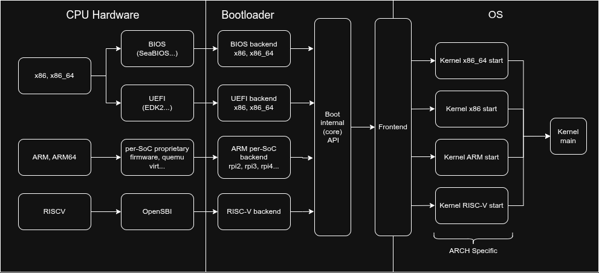

# iperboot

A flexible bootloader.

I want to write a small bootloader which can boot literally *everywhere*, and
where you can easily add new platforms. This project builds upon my previous
work on the following projects:

- [povOS](https://github.com/San7o/povOS/tree/main/bootloader/x86_64)
- [rpi3b-OS](https://github.com/San7o/rpi3b-os)
- [hello-efi](https://github.com/San7o/hello-efi)
- [santOS](https://github.com/San7o/santOS)

To start off, I am planning to implement booting the following platforms:

- UEFI (x86_64, ARM)
- Legacy BIOS (x86_64)
- Qemu Virt (ARM)
- Raspberry Pi 3 (ARM)
- Grub (x86_64)

Eventually I will support RISC-V and other boards like the BeagleBone Black.

## Design

To make the bootloader work with multiple platforms and load many operating
systems, we need to design some abstractions:

- `backend`: the code that gets executed right after the firmware
- `core`: the internal API exposed by the backend and used by the frontend, and
  common code
- `frontend`: the frontend sets up the CPU in a well defined state for the OS.
  This is the API that is presented to the OS, and it must be architecture
  specific.



This project also defines a fully custom frontend API,
[iperboot-protocol](./frontend/iperboot/README.md), inspired by multiboot and
Linux's boot protocol.

## Usage

```bash
git clone --recurse-submodules https://github.com/San7o/iperboot.git
cd iperboot

make
make img
make qemu
```

Select which backend to use (defualt is `eufi`):

```bash
make BACKEND=bios
make img BACKEND=bios
make qemu BACKEND=bios
```
